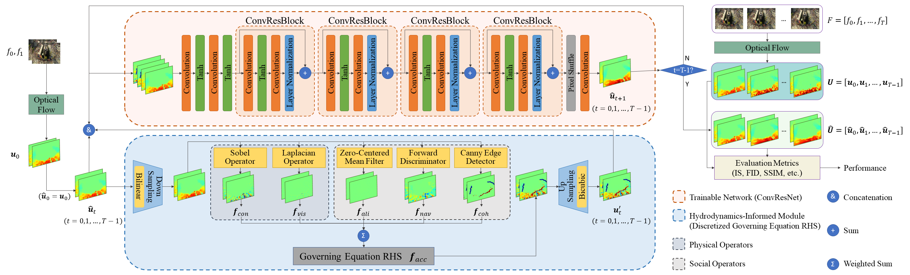

# HINN
Published on ACM Multimedia: [Hydrodynamics-Informed Neural Network for Simulating Dense Crowd Motion Patterns](https://doi.org/10.1145/3664647.3681277)

<p align="center"></p>

## Abstract
With global occurrences of crowd crushes and stampedes, dense crowd simulation has been drawing great attention. In this research, our goal is to simulate dense crowd motions under six classic motion patterns, more specifically, to generate subsequent motions of dense crowds from the given initial states. Since dense crowds share similarities with fluids, such as continuity and fluidity, one common approach for dense crowd simulation is to construct hydrodynamics-based models, which consider dense crowds as fluids, guide crowd motions with Navier-Stokes equations, and conduct dense crowd simulation by solving governing equations. Despite the proposal of these models, dense crowd simulation faces multiple challenges, including the difficulty of directly solving Navier-Stokes equations due to their nonlinear nature, the ignorance of distinctive crowd characteristics which fluids lack, and the gaps in the evaluation and validation of crowd simulation models. To address the above challenges, we build a hydrodynamic model, which captures the crowd physical properties (continuity, fluidity, etc.) with Navier-Stokes equations and reflects the crowd social properties (sociality, personality, etc.) with operators that describe crowd interactions and crowd-environment interactions. To tackle the computational problem, we propose to solve the governing equation based on Navier-Stokes equations using neural networks, and introduce the Hydrodynamics-Informed Neural Network (HINN) which preserves the structure of the governing equation in its network architecture. To facilitate the evaluation, we construct a new dense crowd motion video dataset called Dense Crowd Flow Dataset (DCFD), containing six classic motion patterns (line, curve, circle, cross, cluster and scatter) and 457 video clips, which can serve as the groundtruths for various objective metrics. Numerous experiments are conducted using HINN to simulate dense crowd motions under six motion patterns with video clips from DCFD. Objective evaluation metrics that concerns authenticity, fidelity and diversity demonstrate the superior performance of our model in dense crowd simulation compared to other simulation models.

## Highlights
- We propose a hydrodynamic model which considers both the similarities shared between crowds and fluids, as well as the unique characteristics possessed by crowds, namely physical and social properties.
- We design three operators to describe interactions within dense crowds and between crowds and environments. These operators can be applied to simulate six classic dense crowd motion patterns.
- We construct a new real-world dense crowd video dataset which contains six classic dense crowd motion patterns. Experiments demonstrate the effectiveness of our approach compared with other simulation models by using objective evaluation metrics.

## Dataset
### Dense Crowd Flow Dataset
DCFD contains dense crowd motions of six classic patterns, including line, curve, circle, cross, cluster, and scatter. These crowd motions are sourced from various scenes, such as marathons, parades, intersections, etc. In total, DCFD consists of 457 video clips, which are all collected from open-source video website [Getty Images](https://www.gettyimages.com). Each video clip is cropped into MP4 format with a size of 360×480 pixels, spanning approximately 120 frames. The distribution of these video clips across dense crowd motion patterns is as follows: 135 for line, 50 for curve, 58 for circle, 118 for cross, 46 for cluster, and 50 for scatter.

For access to DCFD or more information on data labeling and processing, please visit our [Google Drive](https://drive.google.com/drive/folders/1q45sp7NWvOqLmyKFxNVZqLN5FT7YG7wo?usp=drive_link).

### Dataset Used in This Reaserch
For the ablation studies and comparative experiments, the training set and the test set are split from DCFD at a ratio of seven to three. In total, 79 video clips are used for training and 47 video clips are allocated for testing. These 126 video clips are available in `data` and can be splited into the training and test sets using our random state in `source/train.py`.

During the evaluation phase, the prediction sets are evaluated by objective metrics including Inception Score (IS), Fréchet Inception Distance (FID), and Structural Similarity (SSIM). IS and FID are calculated based on a classifier called InceptionV3. For InceptionV3, the training set and the test set are split from DCFD at a ratio of eight to two, resulting in 345 video clips for training and 112 video clips for testing.

## Code
### Requirements
```bash
Python 
Pytorch 
Numpy 
OpenCV 
Matplotlib 
Scikit-learn 
```

### Data Generation

### Training

## Citation

